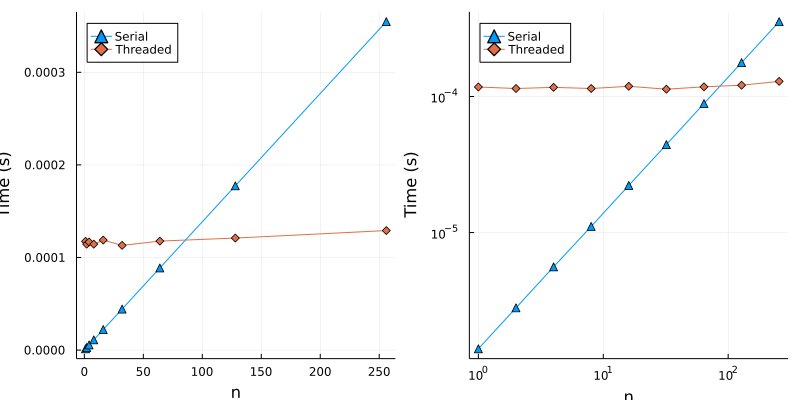

# Examples of Parallelising Code in Julia, comparing multithreading, multiprocessing and GPU (CUDA) code.


This is from a brief talk on implementing different versions of parallel code. Look in `main.jl` for some examples, and the `figures` folder for graphs comparing different implementations.

The file to look at is `main.jl` which contains all the examples top-to-bottom which you can run. The exception is the multiprocessing example which needs to be run separately using:
```bash
julia --project -p 32 -t 1 mp_distributed_example.jl
```
Changing `32` to the number of threads available on your machine. This will overwrite the `.bson` file with results from your own machine.

I suggest running the examples from `main.jl` by copying and pasting into the REPL and following like a Jupyter notebook. You should launch the REPL using:
```bash
julia --project -t 32
```
Changing 32 to the number of threads on your machine. Before running any of the code, one should run:
```julia
using Pkg;
Pkg.instantiate()
using CUDA
CUDA.versioninfo()
```
This will install all the packages and download any artefacts you will need to run the code. Make sure you have an NVIDIA GPU available on your system. If not, avoid running the CUDA section of `main.jl`.

## Results

All results gathered using a 32 core AMD Threadripper CPU (2nd Gen Ryzen) and an NVIDIA 1080ti GPU. Using Julia 1.7.3.

### Serial vs Threaded (T=1000 - short):




### Serial vs Threaded (T=1,000,000 - long):


### Serial vs Threaded vs Multiprocessing (T=1,000,000 - long):


### Threads vs GPU Custom Kernel:


### Threads vs GPU Vectorised Code (Same Function):


